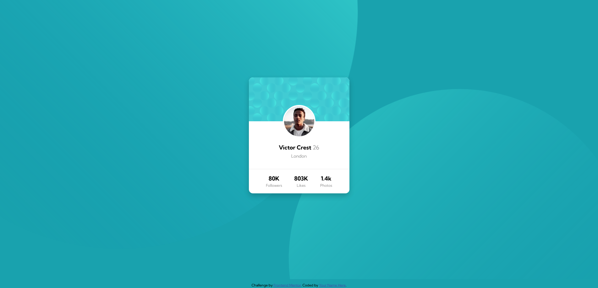

# Frontend Mentor - Profile card component solution

This is a solution to the [Profile card component challenge on Frontend Mentor](https://www.frontendmentor.io/challenges/profile-card-component-cfArpWshJ). Frontend Mentor challenges help you improve your coding skills by building realistic projects. 

## Table of contents

- [Overview](#overview)
  - [The challenge](#the-challenge)
  - [Screenshot](#screenshot)
  - [Links](#links)
- [My process](#my-process)
  - [Built with](#built-with)
  - [What I learned](#what-i-learned)
  - [Continued development](#continued-development)
  - [Useful resources](#useful-resources)
- [Author](#author)

## Overview

### The challenge

- Build out the project to the designs provided

### Screenshot

### Links

- Solution URL: [Github](https://github.com/Chiggs-I-Am/fm-profile-card-component)
- Live Site URL: [View live example](https://chiggs-i-am.github.io/fm-profile-card-component)

## My process

### Built with

- Semantic HTML5 markup
- CSS custom properties
- Flexbox
- CSS Grid
- Mobile-first workflow

### What I learned

I learned a bit about the background css property.

### Continued development

I need to understand background-image positioning a bit more.

### Useful resources

- [CSS Tricks](https://css-tricks.com) - Really good place for general CSS stuff.
- [Google](https://www.google.com) - Never forget...use Google!

## Author

- Frontend Mentor - [@Chiggs-I-Am](https://www.frontendmentor.io/profile/Chiggs-I-Am)
